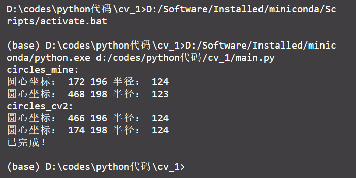

# cv作业1

[TOC]

**张扬2020212185**

## 第一步：读取图像并缩小图像

```py
"""
第一步：读取图像并缩小图像
"""
img_gray = cv2.imread(Path, cv2.IMREAD_GRAYSCALE)           #读取图像
# print("img_gray:\n", img_gray)                  
img_RGB = cv2.imread(Path)                                      
# print("img_RGB:\n", img_RGB)
y, x = img_gray.shape[0:2]                                  #获取图像大小
img_gray = cv2.resize(img_gray, (int(x / Reduced_ratio), int(y / Reduced_ratio))) #缩小图像    
img_RGB = cv2.resize(img_RGB, (int(x / Reduced_ratio), int(y / Reduced_ratio)))
img_RGB_cv2 = img_RGB.copy()
```

分别读取**灰度图**和**RGB图**，获取图像大小，按照`Reduced_ratio`缩小图像，分成两份，一份用于自写的算法，一份用于`cv2`自带的包.

## 第二步：检测边缘`canny`

```python
"""
第二步：检测边缘
"""
canny = cm.Canny(img_gray)                                      #自写的canny实例化
edges = canny.canny()                                           #检测边缘
cv2.imwrite(Save_Path + "canny_result_mine.jpg", edges)         #生成检测边缘后的图像
```

首先实例化自写的`canny`,运行`canny`,**检测边缘**并保存在`edges`变量中,然后生成检测边缘后的图像并**保存**为`"canny_result_mine.jpg"`.

自写的`canny`在`canny_mine.py`中,主要步骤为

1. **高斯**滤波`cm.gaussian_filter()`、`cm.gaussian_kernel()`
2. **Sobel**滤波`cm.sobel_filter()`
3. **非极大值抑制**`cm.non_max_suppression()`
4. **双阈值**筛选`cm.threshold()`
5. 连接**弱边缘**`cm.hysteresis()`

自写的`canny`注释较为详细，包含了所有的**参数说明**，，可以移步[canny_mine.py](https://github.com/jonnyzhang02/cv_1/blob/master/canny_mine.py)查看.

运行效果：


## 第三步：检测圆`Hough`

```py
"""
第三步：检测圆
"""
Hough = hm.Hough_transform(edges_cv2, canny.angle, step=5, threshold=25)          #自写的hough实例化
circles = Hough.Calculate() 
```

首先实例化自写的`Hough_transform`,运行`Hough.Calculate()`，检测圆并保存在`circles`中.

自写的`Hough_transform`在`hough_mine.py`中，主要思想如下：

1. 建立**参数空间**；
2. 依据边缘点的梯度方向对参数空间进行**投票**；
3. 依据预设定的**投票阈值筛选**出初步结果；
4. 对已筛选出的结果进行**非极大化抑制**，得到精确的参数（**圆心和半径**）。

自写的`hough`注释较为详细，包含了所有的**参数说明**，可以移步[hough_mine.py](https://github.com/jonnyzhang02/cv_1/blob/master/hough_mine.py)查看.

## 第四步：画圆，保存图像

```py
"""
第四步：画圆，保存图像
"""         
# 画自写的hough检测圆
if len(circles):                                         #如果检测到圆        
    circles = np.uint16(np.around(circles))                     #四舍五入取整
    for circle in circles[:]:                                #遍历每个圆 
        print("圆心坐标：", circle[0], circle[1], "半径：", circle[2]) # 打印圆心坐标和半径
        cv2.circle(img_RGB, (circle[0], circle[1]),             #画圆
                   circle[2], (132, 135, 239), 2)
    cv2.imwrite(Save_Path + "hough_result_mine.jpg", img_RGB)       #保存检测圆后的图像
```

遍历`circles`，四舍五入取整，打印圆心坐标和半径，保存画圆后的图像为`"hough_result_mine.jpg"`

运行效果：




## 第五步：与`cv2`自带的`canny`检测边缘和`hough`检测圆对比

```py
"""
第五步：与cv2自带的canny检测边缘和hough检测圆对比
"""
use_cv2 = True
if use_cv2:
    # cv2自带的canny检测边缘
    edges_cv2 = cv2.Canny(img_gray, 120, 180)                   #检测边缘
    cv2.imwrite(Save_Path + "canny_result_cv2.jpg", edges_cv2)  #生成检测边缘后的图像

    # cv2自带的hough检测圆
    circles_cv2=cv2.HoughCircles(edges_cv2, cv2.HOUGH_GRADIENT, 1, y/8, param1= 100,param2= 60,minRadius= 10, maxRadius= 150)  #检测圆       
    # 画cv2自带的hough检测圆
    if circles_cv2 is not None:                                 #如果检测到圆
        circles_cv2 = np.uint16(np.around(circles_cv2))         #四舍五入取整
        print("circles_cv2:")
        for circle in circles_cv2[0, :]:                        #遍历每个圆 
            print("圆心坐标：", circle[0], circle[1], "半径：", circle[2])
            cv2.circle(img_RGB_cv2, (circle[0], circle[1]), circle[2], (132, 135, 239), 2)     #画圆  
            
    cv2.imwrite(Save_Path + "hough_result_cv2.jpg", img_RGB_cv2)   
```

仍然按照上面所说的四个步骤进行,只不过直接调用`cv2`的**库**,`canny`后存为`"canny_result_cv2.jpg"`,检测圆后存为`"hough_result_cv2.jpg"`,同时**打印圆心和半径**.

项目已`push`到**Github**[jonnyzhang02/cv_1 (github.com)](https://github.com/jonnyzhang02/cv_1)

